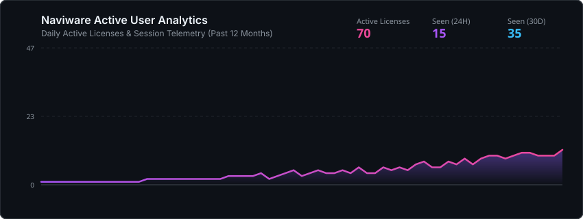

# Naviware Insights & Telemetry

Automated aggregated system telemetry and usage analytics for **Naviware Engine**.

## 📊 Active User Growth

## 📈 Current Overview Metrics

| Metric | Value | Description |
| :--- | :--- | :--- |
| **Active Licenses** | `70` | Enabled and not expired |
| **Seen (24H)** | `15` | Unique logins in last 24 hours |
| **Seen (7D)** | `25` | Unique logins in last 7 days |
| **Seen (30D)** | `35` | Unique logins in last 30 days |
| **Countries** | `18` | Geographic distribution |
| **Bound HWIDs** | `68` | Locked PCs |
| **Encrypted Rate** | `98.92%` | Transport security compliance |

## 🔒 Security & Privacy
- **Data Policy**: Only non-sensitive, aggregated metrics are recorded.
- **Metrics tracked**: Active license counts, session requests, system availability, and response latency.
